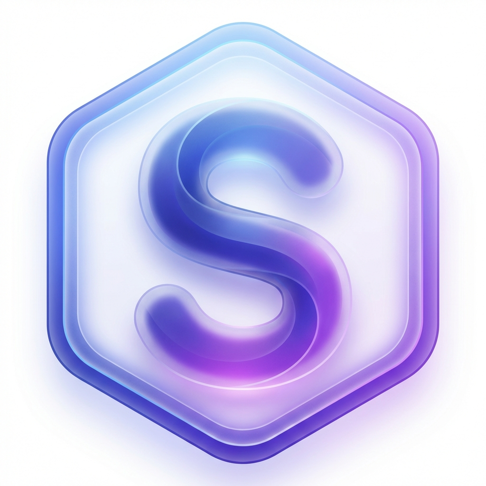

# SkribbleFlo 🌊

<div align="center">
  
</div>

<div align="center">
  <video 
    src="https://github.com/user-attachments/assets/73284876-f8ca-47e6-987d-e4d582d8248b" 
    width="100%" 
    controls
    autoplay 
    muted 
    loop
    style="border-radius: 10px; box-shadow: 0 10px 30px rgba(0,0,0,0.15); border: 1px solid rgba(0,0,0,0.1);"
  ></video>
</div>

<br />

**ScribbleFlow** is a powerful, "Starlight Premium" browser extension that turns any webpage into an infinite canvas. Whether you're presenting designs, collaborating with a team, or just annotating content, ScribbleFlow provides a seamless, high-performance overlay for all your creative needs.


## ✨ Features

### 🎨 Powerful Drawing Tools
*   **Pen & Eraser**: Fluid, pressure-sensitive drawing experience.
*   **Shapes**: Create perfect Rectangles and Circles instantly.
*   **Typography**: Add text annotations with customizable fonts (Inter, Caveat, JetBrains Mono).
*   **Smart Mode**: Automatically recognizes your scribbles and converts them into perfect geometric shapes.

### 🎥 Presentation & Recording
*   **Laser Pointer**: A fading trail pointer perfect for live demos and walkthroughs.
*   **Video Recording**: Capture your entire annotation session (canvas + audio) and download it as high-quality video.
*   **Presentation Mode**: Click to auto-zoom and focus on specific elements of the webpage.
*   **Export**: Download your masterpiece as a transparent PNG.

### 🤝 Real-Time Collaboration
*   **Multiplayer Mode**: Toggle "Co-op" to see other users' cursors and strokes in real-time.
*   **Live Sync**: Powered by **Appwrite** for low-latency state synchronization.

### 💎 Premium Experience
*   **Starlight Theme**: A deep, aesthetic dark mode UI with glassmorphism effects (`backdrop-blur-xl`).
*   **Contextual Dock**: A smart floating dock that reveals tools only when you need them.
*   **Tooltips**: Elegant, portal-based hover tags that never get clipped.
*   **Undo/Redo**: Robust history system with state preservation.

## 🛠️ Tech Stack

*   **Frontend**: React (v18), TypeScript, Vite
*   **Styling**: Tailwind CSS, Framer Motion (Animations)
*   **Canvas Engine**: Fabric.js (v6)
*   **Backend / Real-time**: Appwrite (Auth & Database)
*   **Build Tool**: CRXJS (Vite Plugin for Chrome Extensions)

## 🚀 Getting Started

### Prerequisites
*   Node.js (v18+)
*   npm or yarn

### Installation

1.  **Clone the repository**
    ```bash
    git clone https://github.com/Hardik180704/skribbleflo.git
    cd skribbleflo
    ```

2.  **Install dependencies**
    ```bash
    npm install
    ```

3.  **Environment Setup**
    Create a `.env` file in the root directory:
    ```env
    VITE_APPWRITE_ENDPOINT=https://cloud.appwrite.io/v1
    VITE_APPWRITE_PROJECT_ID=your_project_id
    ```

4.  **Run Development Build**
    ```bash
    npm run dev
    ```
    This will start the Vite server in watch mode.

5.  **Load into Chrome**
    1.  Open Chrome and navigate to `chrome://extensions`.
    2.  Enable **Developer Mode** (top right).
    3.  Click **Load unpacked**.
    4.  Select the `dist` folder generated in your project root.

## 🎮 Usage Guide

1.  **Activate**: Click the ScribbleFlow extension icon in your browser toolbar to inject the canvas overlay.
2.  **The Dock**: Use the floating dock on the left to select tools.
    *   **Select (V)**: Move and resize objects.
    *   **Pen (P)**: Draw freehand.
    *   **Laser**: Temporary trail for pointing.
3.  **Properties**: precise control over color, brush size, and fonts via the contextual panel.
4.  **Context Menu**: Click any shape to reveal options like **Delete**.
5.  **Video**: Click the **Record** button to start capturing your session.

## 🤝 Contributing

Contributions are welcome! Please feel free to submit a Pull Request.

1.  Fork the Project
2.  Create your Feature Branch (`git checkout -b feature/AmazingFeature`)
3.  Commit your Changes (`git commit -m 'Add some AmazingFeature'`)
4.  Push to the Branch (`git push origin feature/AmazingFeature`)
5.  Open a Pull Request

## 📄 License

Distributed under the MIT License. See `LICENSE` for more information.
